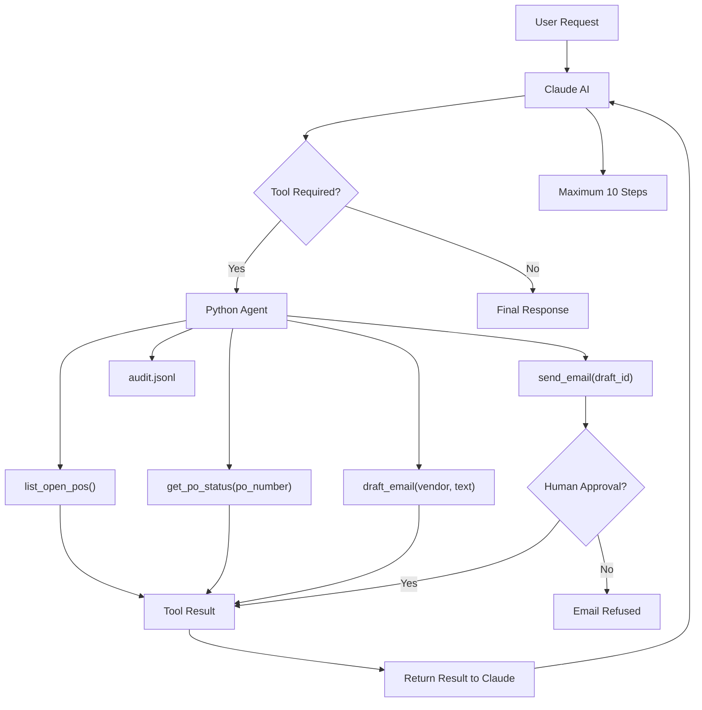

# Day 05 – Agent Loop Diagram

This diagram shows how the Claude AI agent uses Python tools, handles human approval, and records tool activity.

```mermaid
flowchart TD
    A["User Request"] --> B["Claude AI"]
    B --> C{"Tool Required?"}
    C -->|Yes| D["Python Agent"]
    D --> E["list_open_pos()"]
    D --> F["get_po_status(po_number)"]
    D --> G["draft_email(vendor, text)"]
    D --> H["send_email(draft_id)"]
    E --> I["Tool Result"]
    F --> I
    G --> I
    H --> J{"Human Approval?"}
    J -->|Yes| I
    J -->|No| K["Email Refused"]
    I --> L["Return Result to Claude"]
    L --> B
    C -->|No| M["Final Response"]
    B --> N["Maximum 10 Steps"]
    D --> O["audit.jsonl"]
```
